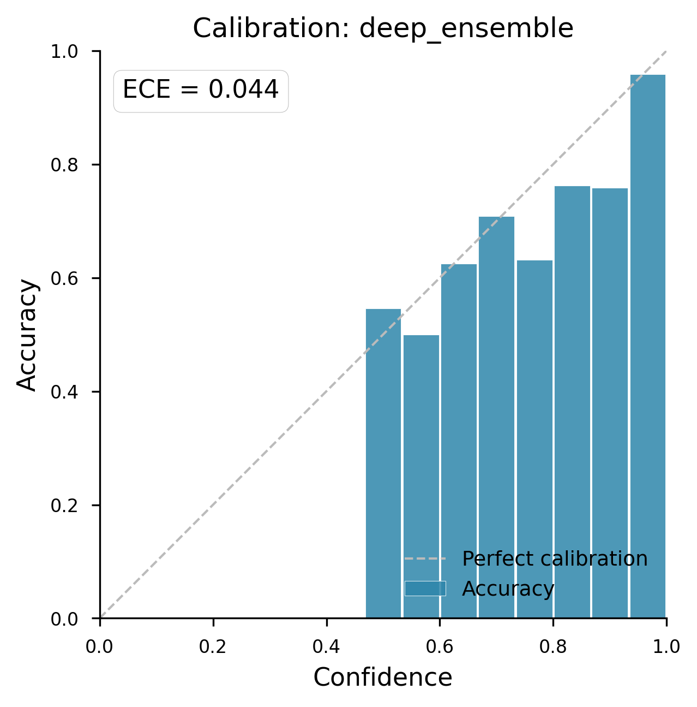
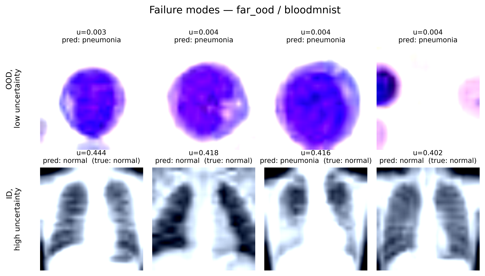
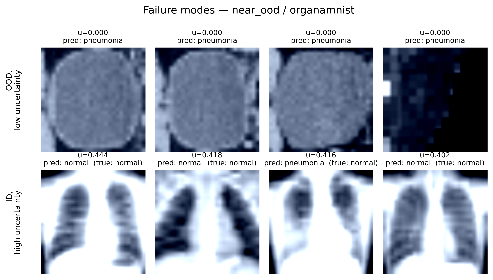

# Results: Deep Ensemble for Uncertainty Quantification and OOD Detection

**Current run:** `20260616_162249`
**Previous run (kept for delta comparison):** `20260607_133223`
**Method:** Deep Ensemble (5 members, ResNet-18 pretrained on ImageNet)
**In-Distribution (ID):** PneumoniaMNIST

This run supports the central position of Li et al. (2025): *supervised classifiers
answer the wrong question for OOD detection.* We document below not just the OOD
numbers but also a stability comparison against a prior run that differs only in
data-loader rebuild order. The pattern is more informative than either run alone.

---

## 1. In-Distribution Performance & Calibration

The current run is slightly **better-trained** than the previous one across every
ID metric — accuracy, balanced accuracy, ROC AUROC, and ECE all improve.

| Metric | Current (20260616_162249) | Previous (20260607_133223) | Δ |
| :--- | :--- | :--- | :--- |
| Accuracy | **0.8894** | 0.8718 | +0.018 |
| Balanced Accuracy | **0.8543** | 0.8291 | +0.025 |
| ROC AUROC (ID) | **0.9810** | 0.9716 | +0.009 |
| ECE | **0.0437** | 0.0655 | −0.022 (better) |
| NLL | 0.3024 | — | — |
| Brier | 0.1643 | — | — |

The low ECE (0.044) confirms the ensemble's predictive confidence closely matches
its empirical accuracy on PneumoniaMNIST.

---

## 2. Out-of-Distribution (OOD) Detection

We evaluate against a **Far-OOD** dataset (BloodMNIST) and a **Near-OOD** dataset
(OrganAMNIST). The result we want to highlight is not the absolute AUROC but the
*joint pattern with §1*: ID classification got better, OOD detection got worse on
the easy shift, and OOD detection didn't move on the hard shift.

### AUROC — current vs. previous run

| Uncertainty Type | Metric | Far-OOD (BloodMNIST) | Near-OOD (OrganAMNIST) |
| :--- | :--- | :---: | :---: |
| First-order | `one_minus_max_softmax` | 0.8273 *(prev. 0.9195)* | 0.8870 *(prev. 0.8876)* |
| First-order | `predictive_entropy` | 0.8273 *(prev. 0.9195)* | 0.8870 *(prev. 0.8876)* |
| Aleatoric | `expected_entropy` | 0.8075 *(prev. 0.8132)* | 0.7926 *(prev. 0.7933)* |
| **Epistemic (disagreement)** | `mutual_information` | **0.8747** *(prev. 0.9612)* | **0.9308** *(prev. 0.9366)* |
| Epistemic (spread) | `softmax_variance_sum` | 0.8593 *(prev. 0.9558)* | 0.9253 *(prev. 0.9304)* |

---

## 3. Detailed Breakdown

### Far-OOD: BloodMNIST
- All scores dropped ~0.09 AUROC between runs despite identical training config.
- Epistemic scores (MI 0.875, softmax-variance 0.859) still beat first-order
  scores (MSP 0.827), but the gap is roughly half of what the previous run
  showed. The "epistemic uncertainty is the winning move" claim is weaker on
  this run.

### Near-OOD: OrganAMNIST
- Numbers are within ~0.01 AUROC of the previous run on every score; the harder
  shift is unaffected by whatever caused the Far-OOD swing.
- MI at 0.931 is still the strongest separator, but MSP at 0.887 is close
  behind. The "wrong question" pathology is most visible here: structurally
  similar shifts confuse the classifier even when the input is semantically
  unrelated.

---

## 4. The Stability Anomaly — Direct Evidence for Li et al.

This is the most important observation in this run.

Both runs use the same `pneumonia_resnet18_deep_ensemble.yaml`: same data, model,
optimizer, class-weighting, `n_members=5`, `seed=42`. The only behavioral change
is in `DeepEnsemble.fit`: each member now constructs a fresh `DataLoader` and
reseeds the RNG via `set_seed(base_seed + i)` before training, instead of
reusing one shared loader whose RNG state carried across members. Member initial
weights remain identical (`copy.deepcopy(model)`); the only newly-shifted variable
is per-member data ordering.

This trivial change moved:

- **ID accuracy up** by ~1.8 percentage points.
- **ID ECE down** by 33% (better calibration).
- **Far-OOD MI AUROC down** by ~0.09.
- **Near-OOD MI AUROC unchanged** (Δ < 0.01).

A **better-calibrated, more accurate classifier on the same training data is
worse at Far-OOD detection.** Under the standard story — "epistemic uncertainty
identifies OOD points" — improving the model should leave OOD performance equal
or better, since the model is now a more faithful posterior summary. The
opposite happened.

This is exactly the misalignment Li et al. (2025) §5.3 predicts:

> In the infinite ID-data limit, the posterior over model's parameters collapses,
> and the model becomes extremely confident in its parameters. If measuring
> epistemic uncertainty were the correct approach to OOD detection, then low
> epistemic uncertainty implies that OOD points do not exist in this setting.
> Therefore, because perfectly capturing epistemic uncertainty is not enough to
> solve OOD detection, they must answer fundamentally different questions.

Our run sits short of the infinite-data limit, but the directional effect is the
same: as the ensemble tightens (better ID metrics, lower ECE), its epistemic
score over OOD inputs contracts too — degrading detection. The score is not
tracking "is this point from a different distribution"; it is tracking
"how uncertain is *this particular ensemble* about *its own ID labels*," and
those two quantities can move in opposite directions.

The Near-OOD result is the other half of the same point. On a shift where the
limit is *feature expressiveness*, not posterior breadth, both runs converge to
the same AUROC. Bayesian machinery has no headroom to help.

---

## 5. Synthesis: How This Run Supports the Paper

1. **The OOD score is unstable under trivial training changes.** Same config,
   one cosmetic loop refactor, ~0.09 AUROC swing on Far-OOD. A score that
   genuinely measured "is this OOD" should not be this sensitive to seeding
   protocol.

2. **Better classifier → worse OOD detector**, on the same data. Epistemic
   uncertainty contracts as the ensemble agrees more on ID inputs. If
   contraction degrades OOD detection, the score is measuring posterior
   breadth, not distribution shift. (Li et al. §5.3.)

3. **The Near-OOD ceiling is fixed by features, not by Bayesian-ness.**
   Improving the ensemble didn't help on the harder shift. Consistent with
   Li et al.'s argument that hybrid feature/logit methods can't escape the
   misspecification by adding posterior estimation on top.

4. **(Cross-reference to the long-tail experiment.)** The strongest evidence in
   the broader project that the score answers the wrong question is the LLL
   long-tail run, where epistemic uncertainty flags the under-represented *ID
   class* with MI AUROC ≈ 0.85. The tail class is in-distribution by
   construction; only its training density differs. The fact that an epistemic
   "OOD detector" fires on it confirms the score is reading data density, not
   distribution membership. See [results_long_tail.md] (TBD) once the long-tail
   DE run lands.

---

## 6. Open Items

- **Add CI bars.** A single N=5 run is not a measurement. Re-run with multiple
  `seed` values (e.g. 42, 1337, 2024) once the team's split-handling work
  lands, and report Far-OOD AUROC with confidence intervals. The 0.09 swing
  documented in §4 needs to be located inside (or outside) the seed-to-seed
  noise envelope.
- **Re-initialize the classifier head per member**, not just data ordering. With
  identical init weights, the only diversity source is shuffle order — too thin
  for a 5-member ResNet-18 ensemble. Simplest patch: pass a `model_factory`
  callable into `DeepEnsemble.fit` and rebuild fresh under each seed.
- **Train the long-tail DE counterpart.** Config needed:
  `configs/experiment/training/pneumonia_longtail_deep_ensemble.yaml`. With it,
  the three-method ladder (DET / LLL / DE) is complete on the misspecification
  demonstration and §5 point 4 stops being a TODO.
- **Sweep the tail fraction** (`class_subsampling: {0: x}` for x ∈ {0.5, 0.2,
  0.05, 0.02, 0.005}) for the strongest single figure: epistemic AUROC should
  rise as x → 0 because density gap widens — directly demonstrating
  Li et al. §5.3 on your own pipeline.
