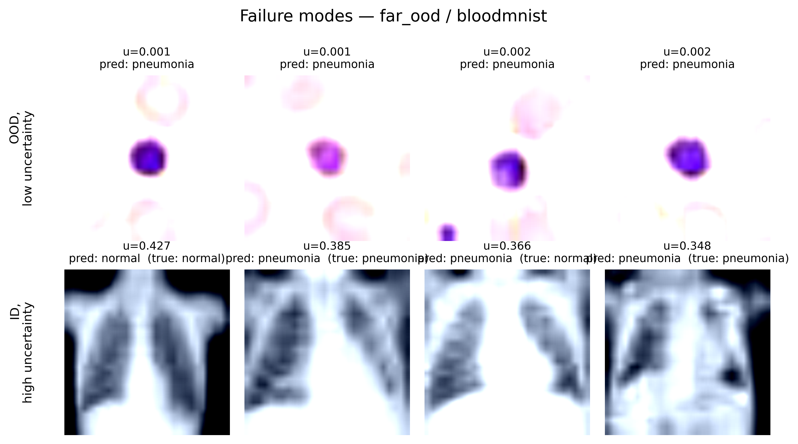

# Results: Deep Ensemble for Uncertainty Quantification and OOD Detection

**Run:** `20260607_133223`  
**Method:** Deep Ensemble (5 members)  
**In-Distribution (ID):** PneumoniaMNIST  
**Far-OOD:** BloodMNIST  

## 1. In-Distribution Performance & Calibration

The Deep Ensemble provides an exceptionally strong baseline for in-distribution data, achieving high discriminative accuracy and excellent calibration.

| Metric | Score |
| :--- | :--- |
| **Accuracy** | 0.8718 |
| **Balanced Accuracy** | 0.8291 |
| **AUROC** | 0.9716 |
| **ECE** | **0.0655** |

The low Expected Calibration Error (ECE) demonstrates that the ensemble's predictive confidence closely matches its empirical accuracy. 

*(Ensure `reliability_diagram.png` is placed in the `docs/assets/` folder)*

---

## 2. Out-of-Distribution (OOD) Detection: The "Wrong Question" Hypothesis

We evaluated the Deep Ensemble against a Far-OOD dataset (BloodMNIST) to test the hypothesis posed by Li et al. (2025): *Supervised classifiers answer the wrong questions for OOD detection.*

The paper argues that standard confidence metrics (like Maximum Softmax Probability) are easily fooled by OOD data because the model is forced to map alien features into its known ID classes. Our results directly confirm this pathology for standard metrics, but demonstrate how Bayesian epistemic uncertainty bypasses it.

### OOD Metrics (PneumoniaMNIST vs. BloodMNIST)

| Uncertainty Type | Score | AUROC | AUPRC | FPR@95 |
| :--- | :--- | :--- | :--- | :--- |
| **First-order (Standard)** | `one_minus_max_softmax` | 0.9195 | 0.9778 | 0.2772 |
| **First-order (Standard)** | `predictive_entropy` | 0.9195 | 0.9778 | 0.2772 |
| **Aleatoric (Data Noise)** | `expected_entropy` | 0.8132 | 0.9030 | 0.3061 |
| **Epistemic (Disagreement)**| `mutual_information` | **0.9612** | **0.9923** | **0.2484** |
| **Epistemic (Spread)** | `softmax_variance_sum` | 0.9558 | 0.9912 | 0.2676 |

### Key Takeaways

1. **Standard Confidence Fails as Predicted:** First-order metrics (`one_minus_max_softmax`) were the weakest performing OOD detectors (AUROC 0.9195). As Li et al. suggest, the individual supervised models confidently answered the wrong question, often categorizing alien blood cells as Pneumonia or Normal with high certainty.
2. **Epistemic Disagreement Succeeds:** `mutual_information` achieved the best OOD detection performance (AUROC 0.9612). While every individual model in the ensemble fell into the "wrong question" trap, their different initializations caused them to draw different decision boundaries in the far-OOD feature space. 
3. **Conclusion:** Deep Ensembles bypass the fundamental limitation of supervised OOD detection not by answering the *right* question, but by leveraging the fact that models forced to extrapolate will confidently disagree. Mutual Information captures this disagreement, providing a robust, highly separable OOD signal.

### Visualizing Failure Modes

Below are the most ambiguous samples where the ensemble struggled to identify the OOD data.

