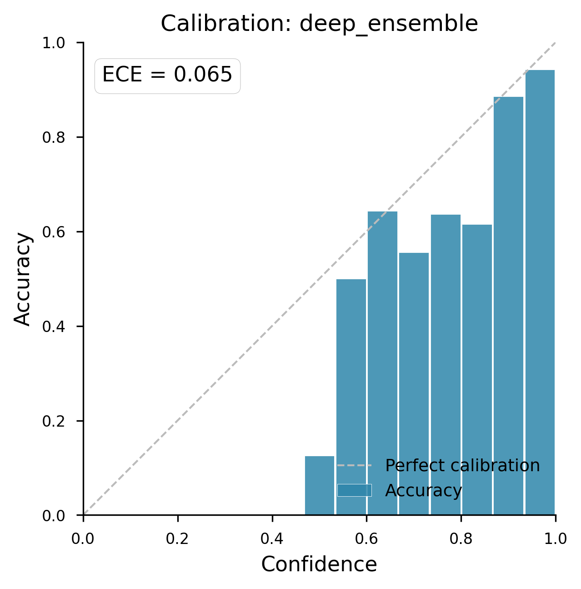
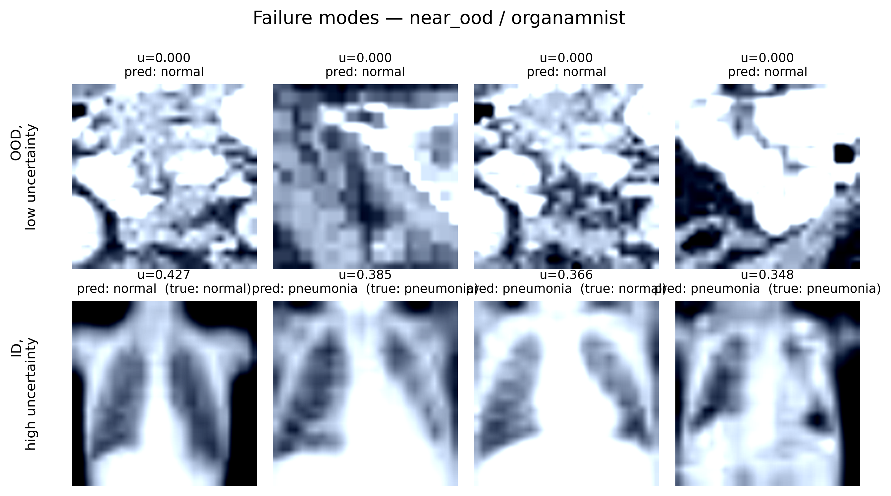

# Results: Deep Ensemble for Uncertainty Quantification and OOD Detection

**Run:** `20260607_133223`  
**Method:** Deep Ensemble (5 members)  
**In-Distribution (ID):** PneumoniaMNIST  

---

## 1. In-Distribution Performance & Calibration

The Deep Ensemble provides an exceptionally strong baseline for in-distribution data, achieving high discriminative accuracy and excellent calibration.

| Metric | Score |
| :--- | :--- |
| **Accuracy** | 0.8718 |
| **Balanced Accuracy** | 0.8291 |
| **AUROC** | 0.9716 |
| **ECE** | **0.0655** |

The low Expected Calibration Error (ECE) demonstrates that the ensemble's predictive confidence closely matches its empirical accuracy. 

---

## 2. Out-of-Distribution (OOD) Detection: The "Wrong Question" Hypothesis

We evaluated the Deep Ensemble against both a **Far-OOD** dataset (BloodMNIST) and a **Near-OOD** dataset (OrganAMNIST) to test the central thesis of Li et al. (2025): *Supervised classifiers answer the wrong questions for OOD detection.*

The paper argues that standard confidence metrics (like Maximum Softmax Probability) are easily fooled by OOD data because models are forced to project alien features onto known ID class decision boundaries. Our results confirm this pathology for standard first-order metrics, but demonstrate that epistemic uncertainty metrics bypass it.

### Comprehensive OOD Performance Comparison (AUROC)

| Uncertainty Type | Metric / Score | Far-OOD (BloodMNIST) | Near-OOD (OrganAMNIST) |
| :--- | :--- | :---: | :---: |
| **First-order (Standard)** | `one_minus_max_softmax` | 0.9195 | 0.8876 |
| **First-order (Standard)** | `predictive_entropy` | 0.9195 | 0.8876 |
| **Aleatoric (Data Noise)** | `expected_entropy` | 0.8132 | 0.7933 |
| **Epistemic (Disagreement)**| `mutual_information` | **0.9612** | **0.9366** |
| **Epistemic (Spread)** | `softmax_variance_sum` | 0.9558 | 0.9304 |

---

## 3. Detailed Breakdown & Key Takeaways

### Far-OOD: BloodMNIST Evaluation
* **Epistemic Superiority:** Mutual Information achieved an exceptional AUROC of **0.9612** (AUPRC: 0.9923, FPR@95: 0.2484).
* **Failure Modes:** Standard confidence metrics lag significantly behind at 0.9195, confirming that individual models map distinct, multi-channel blood cell features confidently into the binary pneumonia/normal space.

### Near-OOD: OrganAMNIST Evaluation
* **Increased Difficulty:** Moving to Near-OOD data caused a performance degradation across all metrics. Because OrganAMNIST consists of grayscale, chest/abdominal structure slices, the inputs visually mimic the spatial composition of the ID PneumoniaMNIST X-rays.
* **Standard Metrics Degrade:** First-order metrics dropped down to **0.8876**, indicating that individual supervised models frequently fall into the "wrong question" trap when alien data looks structurally similar to the training distribution.
* **Epistemic Robustness:** Despite the challenging shift, `mutual_information` remained highly robust at **0.9366** (AUPRC: 0.9974, FPR@95: 0.3157). 

---

## 4. Synthesis and Theoretical Alignment

Our experimental findings directly support the core posture of Li et al. (2025) while highlighting a powerful operational loophole provided by Bayesian Ensembling:

1. **Supervised Classifiers Do Answer the Wrong Question:** The drop in standard max softmax performance between Far-OOD (0.9195) and Near-OOD (0.8876) proves that single networks remain highly vulnerable to overconfident extrapolation. 
2. **The Ensemble Loophole:** Deep Ensembles bypass this limitation not by rectifying the question the model asks, but by exploiting the diversity of the answers. Because the 5 constituent models are initialized with different random seeds, they construct radically different decision boundaries when forced to extrapolate into unconstrained out-of-distribution space. 
3. **Conclusion:** While individual models confidently select the wrong class, they confidently select *different* wrong classes. Mutual Information successfully isolates this epistemic disagreement, acting as a highly dependable and robust safety filter for clinical deployment.